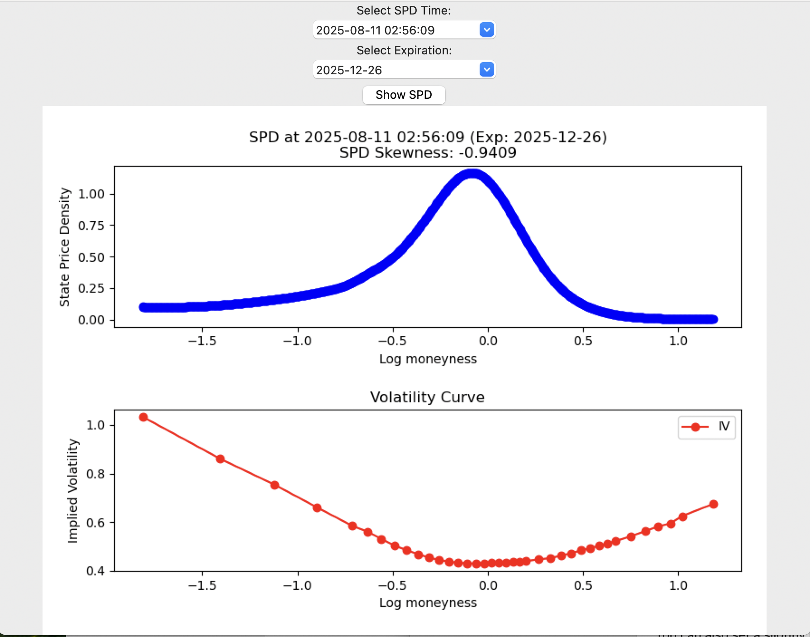
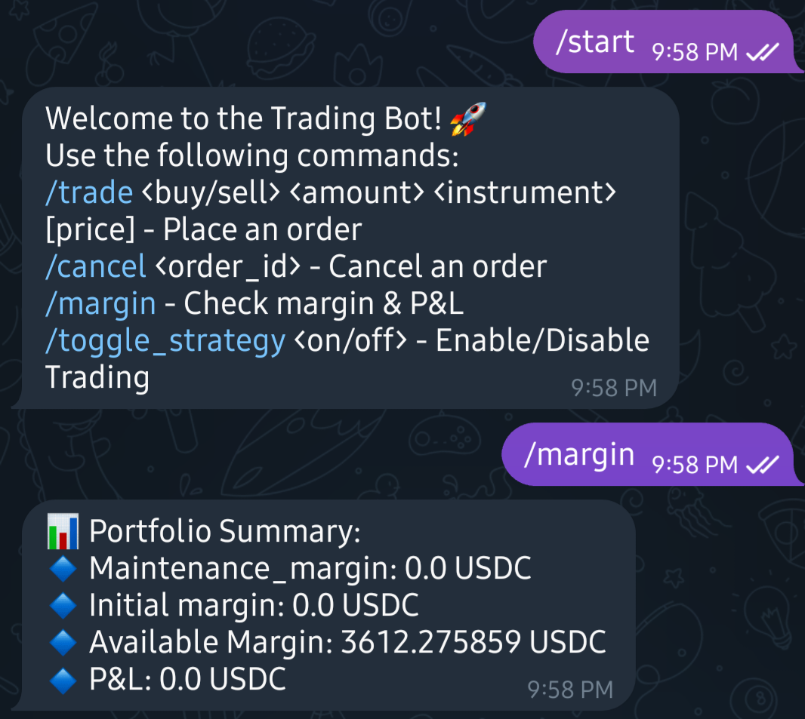
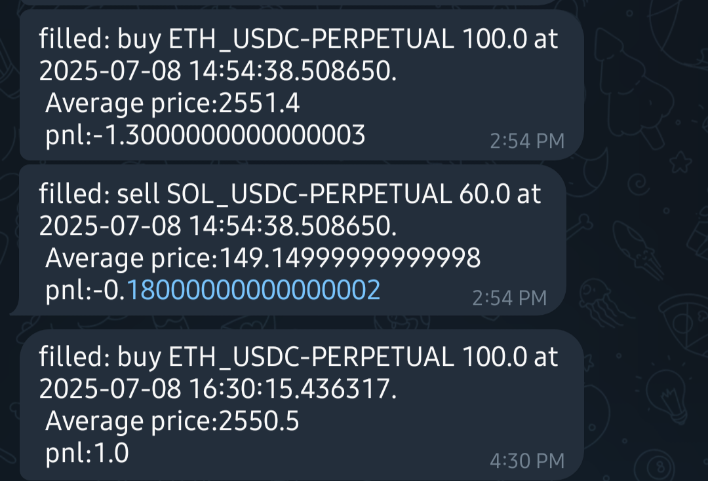

# SkewnessTrade_Deribit

Systematic **options skew strategy** on Deribit using two different expirations.  
The program connects via WebSocket, monitors signals derived from skew between expirations, and can execute trades when enabled.  
Utilities are provided to visualize history (price/IV spreads), skewness (vol-slope), volatility curves, and state price densities.  

At its core, this project implements **Risk Reversal trades** as a proxy for skewness trading.  

---

## Features
- **Two-expiration skew strategy**: Select two or more expirations; strategy evaluates skew and generates signals.  
- **Risk Reversal as skew proxy**: RR captures relative pricing of upside vs downside volatility.  
- **Trade execution toggle**: Dry-run by default; enable execution when ready.  
- **Historical charts**: Price- and IV-based spread charts.  
- **Skewness view**: Slope of volatility curve by expiration (ATM slope proxy).  
- **Vol curves & SPD**: Visualize volatility curves and state price densities.  
- **Telegram monitoring**: Get runtime alerts and trade notifications.  

---

## Strategy details
- **Risk Reversal as skew proxy**  
  The strategy uses a **Risk Reversal (RR)** construct (e.g., long OTM call vs short OTM put of similar absolute gamma or vega) as a practical proxy for skewness strategy.  
  RR captures the relative pricing of upside vs downside volatility.  

- **How skewness is measured**  
  Skewness is proxied by the **slope of the implied volatility curve at-the-money (ATM)**.  
  A steeper positive slope indicates stronger positive skew; a negative slope indicates put-skew dominance.  

- **BTC-specific behavior**  
  BTC tends to exhibit **positive skewness**, unlike many equities that often display negative put skew.  
  In general, the **longer the time to expiration, the stronger the skewness** observed in BTC.  

- **Construction across expirations**  
  By taking **Risk Reversals in opposite directions** across two different expirations simultaneously, the position reduces net delta exposure.  
  (A Risk Reversal by construction already hedges much of **gamma** and **vega** exposure.)  
  If you have a view on near-term options, you can time entries using the nearest expiration while pairing with a longer one.  

- **Execution rule in this code**  
  The strategy executes **only when the instantaneous cost of entry is negative** in both USD and implied volatility terms.  
  In other words, trades are entered only when the expected immediate return is positive.  

---

## Requirements
- **Python**: 3.9+ recommended  
- **Packages**: install from `requirements.txt`  
- **Database**: create tables via `create_tables.sql`  
- **Deribit account**: API access credentials  
- (Optional) **Telegram**: for notifications via `key/bot_token.txt` and `key/chat_id.txt`  

---

### Setup
1) Create a virtual environment and install dependencies
```bash
python -m venv .venv
source .venv/bin/activate
pip install -r requirements.txt
```

2) Create database tables
- Open `create_tables.sql` in your SQL client and execute it against your database.
- If you are using SQLite locally, an example would be:
```bash
sqlite3 strategy.db < create_tables.sql
```

3) Configure keys (if applicable)
- `key/client_id.txt`: Deribit API client_id (one line)
- `key/bot_token.txt`: Telegram bot token (one line, optional)
- `key/chat_id.txt`: Telegram chat id (one line, optional)
- Utilities in `key/generate_key.py` and `key/read_key.py` are available if you prefer scripted handling.

---

### Running the strategy
Start the realtime strategy runner:
```bash
python websocket_client.py
```
You will be prompted for the following:
- **Enter expiration dates (format: DDMMMYY, separated by commas):**
  - Example: `27SEP24,25OCT24`
  - Use uppercase month abbreviations (JAN, FEB, MAR, APR, MAY, JUN, JUL, AUG, SEP, OCT, NOV, DEC).

- **Please input any expiration dates using PERPETUAL price (format: DDMMMYY, separated by commas):**
  - Optional. For expirations listed here, the strategy will reference the PERPETUAL price instead of the specific futures/option underlying as a proxy.
  - Example: `27SEP24`

- **Please input way. SHORT? LONG?:**
  - Choose your directional bias for the strategy. Example: `SHORT` or `LONG`.

- **Execute enabled?:**
  - Control live trading. Use `False` for paper/dry-run, `True` to allow order execution.
  - Example: `False`

Example interactive session:
```text
Enter expiration dates (format: DDMMMYY, separated by commas): 27SEP24,25OCT24
Please input any expiration dates using PERPETUAL price (format: DDMMMYY, separated by commas): 27SEP24
Please input way. SHORT? LONG?: SHORT
Execute enabled?: False
```

---

### Visualization & analysis scripts
- **draw_graph_iv.py**: Plot historical implied volatility and the spread between selected expirations.
  ```bash
  python draw_graph_iv.py
  ```

- **draw_graph_price.py**: Plot historical prices and the spread between expirations.
  ```bash
  python draw_graph_price.py
  ```

- **draw_graph_skew.py**: Display skewness per expiration (implemented as the slope of the volatility curve).
  ```bash
  python draw_graph_skew.py
  ```

- **get_spd_pdf_log.py**: Compute/plot volatility curves and state price densities (log-space PDF view).
  ```bash
  python get_spd_pdf_log.py
  ```

Notes:
- These scripts may read from the same database populated by the live runner.
- If scripts prompt for dates, use `DDMMMYY` format, identical to the strategy runner.

---

### Monitoring (Telegram)
- If Telegram credentials are provided, the algorithm can push runtime alerts and trade notifications.
- Place tokens in `key/bot_token.txt` and chat id in `key/chat_id.txt`.
- Example alert screenshots are referenced in the Illustrations section below.

---

### Best practices
- Start with `Execute enabled? = False` to confirm signals and data flow.
- Verify your date inputs use the exact `DDMMMYY` format and uppercase month.
- Define PERPETUAL-based expirations only if you intend to proxy them with the perpetual price.

---

### Troubleshooting
- If imports fail, re-activate your venv and re-run `pip install -r requirements.txt`.
- If charts are empty, ensure `create_tables.sql` was executed and the live runner has written data.
- If prompts are rejected, re-check the `DDMMMYY` format and comma separation.
- For API/notification issues, verify entries under `key/` files.

---

### Quick start checklist
- Installed dependencies from `requirements.txt`
- Executed `create_tables.sql` against your DB
- Placed credentials in `key/` (if used)
- Ran `python websocket_client.py` and provided required inputs
- Used plotting scripts to inspect historical spreads, skew, and SPD

---

### Illustrations






---

### Disclaimer
Markets involve risk. Use `Execute enabled? = False` until you have fully verified the system and understand the risks of live trading.
